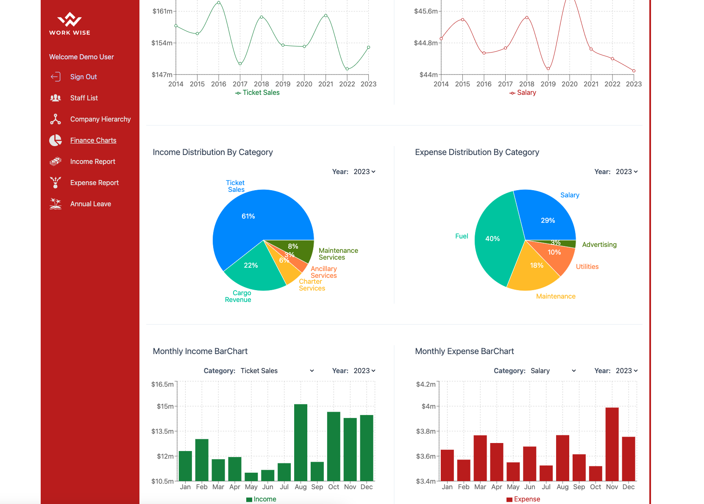

# Workwise Frontend

Workwise Frontend is the frontend application for the Workwise project. It provides the user interface for the Workwise web application.



## Table of Contents

- [Workwise Frontend](#workwise-frontend)
  - [Table of Contents](#table-of-contents)
  - [Features](#features)
  - [Technologies Used](#technologies-used)
  - [Installation](#installation)

## Features

- **React Application**: Built with React, a popular JavaScript library for building user interfaces.
- **Routing**: Utilizes `@tanstack/react-router` for client-side routing within the application.
- **State Management**: Employs `@tanstack/react-query` for managing and caching server state in the frontend.
- **Data Visualization**: Integrates with `recharts` for creating interactive and responsive charts.
- **Form Handling**: Implements `react-hook-form` for easy and efficient form handling and validation.
- **User Authentication**: Integrates with Firebase for user authentication and authorization.
- **Styling**: Utilizes Tailwind CSS for utility-first CSS framework for styling.

## Technologies Used

- React Vite
- @tanstack/react-query
- @tanstack/react-router
- Tailwind CSS
- Firebase
- Recharts
- React Hook Form

## Installation

1. **Clone the repository**:

   ```bash
   git clone https://github.com/bulutyerli/workwise-frontend.git
   cd workwise-frontend
   ```

2. **Create .env file on root**:

   You must sign up for Firebase and write env variables as below.

   ```bash
   VITE_FIREBASE_APIKEY=your-firebase-api-key
   VITE_FIREBASE_AUTH_DOMAIN=your-firebase-auth-domain
   VITE_FIREBASE_PROJECT_ID=your-firebase-project-id
   VITE_FIREBASE_STORAGE_BUCKET=your-firebase-storage-bucket
   VITE_FIREBASE_MESSAGE_SENDER_ID=your-firebase-message-sender-id
   VITE_FIREBASE_APP_ID=your-firebase-app-id
   VITE_FIREBASE_MEASUREMENT_ID=your-firebase-measurement-id
   ```

3. **Install dependencies**:

   ```bash
   npm install
   ```

4. **Run app**:

Workwise Backend - https://github.com/bulutyerli/WorkWise-Backend must also be installed and running before starting the frontend.

```bash
npm run dev
http://localhost:3000
```
